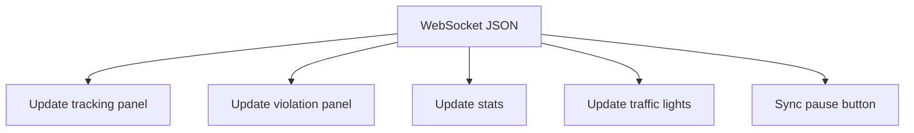

```mermaid
flowchart TD
  A[WebSocket JSON] --> B[Update tracking panel]
  A --> C[Update violation panel]
  A --> D[Update stats]
  A --> E[Update traffic lights]
  A --> F[Sync pause button]

```
